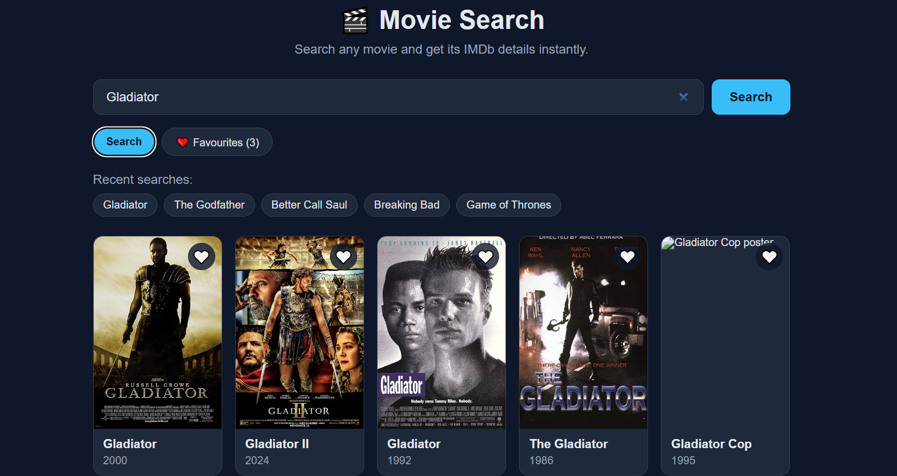
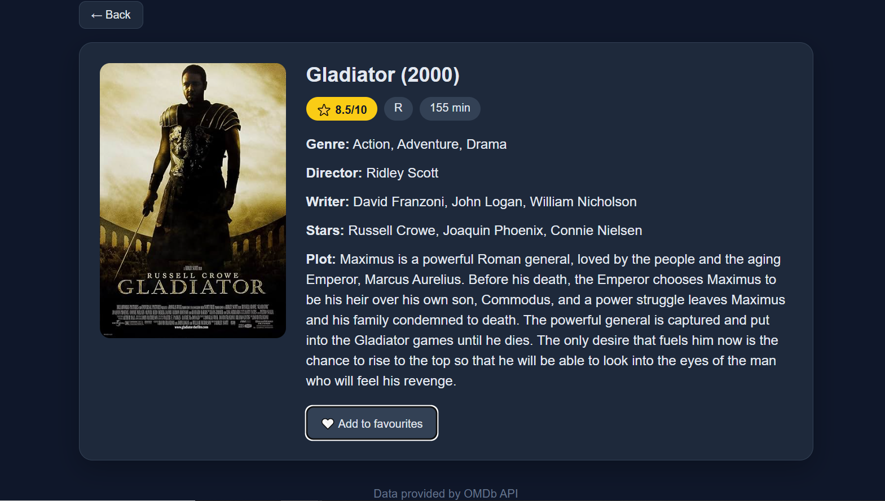

# React Movie Search App 🎬

A movie search web app built with React and the OMDb API. Search for a title, browse the results in a grid, open any movie to see its IMDb rating, runtime, director, writer, cast, genre, and full plot, and save your favourites.

## Live Demo
🔗 [View Live Application](https://react-movie-search-app-umber.vercel.app/)

## Screenshots

| Search results | Movie details |
|---|---|
|  |  |

## Features
- **Search with Results Grid:** Searches the OMDb API by title and shows matching movies as poster cards.
- **Movie Details View:** Click any card to fetch full details (rating, runtime, director, writer, stars, genre, plot) with a second API call by IMDb ID, and go back to your results without searching again.
- **Favourites:** Add or remove movies from a favourites list using the heart button on cards or in the details view. Favourites are saved in `localStorage` and survive page refreshes.
- **Recent Searches:** Keeps your last 5 searches as clickable chips for one-click re-searching.
- **Error Handling:** Handles empty input, "too many results", movies that aren't found, and network failures, and encodes special characters in titles (e.g. "Fast & Furious").
- **Loading States and Fallbacks:** Shows loading messages while fetching and a placeholder when a movie has no poster.
- **Accessible Markup:** Semantic buttons for cards, `aria-label`s, and `aria-live` messages for errors and loading.
- **Responsive Design:** Works on desktop and mobile screens.

## Tech Stack
- **React** (Create React App), using functional components and hooks (`useState`, `useEffect`)
- **JavaScript (ES6+):** async/await, Fetch API, `localStorage`
- **CSS3:** Flexbox, Grid, media queries
- **OMDb API**
- **Vercel** (deployment)

## What I Practised
- Two-step data fetching: list endpoint (`?s=`) followed by a detail endpoint (`?i=`)
- Managing multiple pieces of related state (results, selected movie, loading, errors, favourites)
- Persisting state to `localStorage` safely (lazy state initialisation with `try/catch`)
- Reusing one render function for both search results and favourites
- Keeping the API key out of source code with environment variables

## Getting Started Locally
1. Clone the repository:
```bash
   git clone https://github.com/piyushdhakad001/react-movie-search-app.git
   cd react-movie-search-app
```
2. Install dependencies:
```bash
   npm install
```
3. Get a free API key from [omdbapi.com](https://www.omdbapi.com/apikey.aspx).
4. Create a `.env` file in the project root (you can copy `.env.example`) and add your key:
```
   REACT_APP_OMDB_KEY=your_api_key_here
```
5. Start the app:
```bash
   npm start
```
6. Open `http://localhost:3000`.

## Project Structure
```
src/
├── App.js     # State, API calls, and UI
└── App.css    # Styles
```

## Future Improvements
- Pagination or a "Load more" button for search results
- Splitting `App.js` into smaller components (`SearchBar`, `MovieCard`, `MovieDetails`)
- Debounced search-as-you-type

## Note
This project started as a vanilla JavaScript app and was rebuilt in React. The API key is stored in an environment variable, but because this is a client-side app it is still included in the browser bundle, which is acceptable for OMDb's free tier. Never do this with a paid or private key; use a backend or serverless function instead.