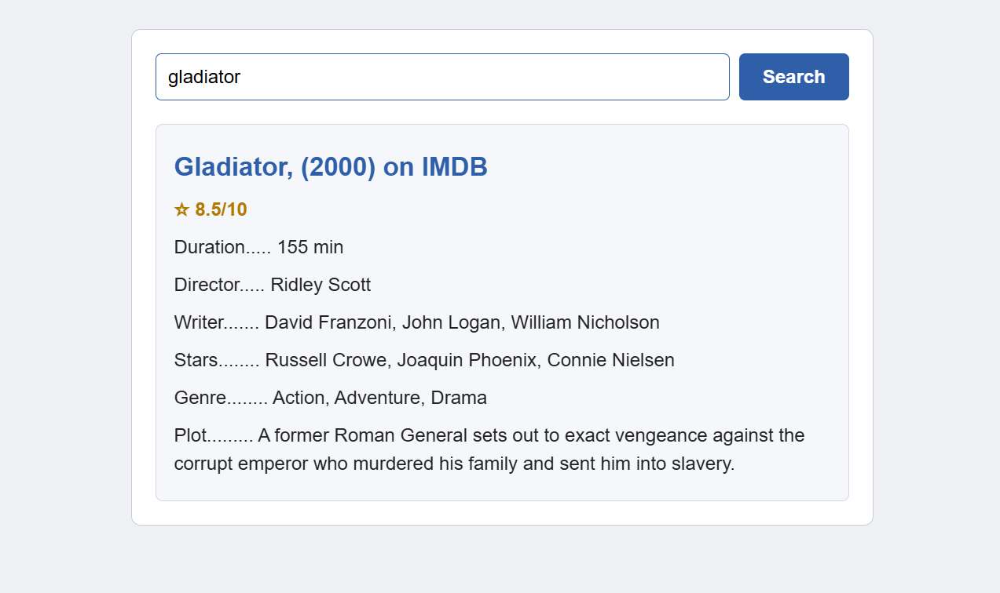

# React Movie Search App 🎬

A movie search web app built with React and the OMDb API. Search any title to see its IMDb rating, runtime, director, writer, cast, genre, and plot.

## Live Demo
🔗 [View Live Application](https://react-movie-search-app-umber.vercel.app/)

## Screenshot



## Features
- **OMDb API Integration:** Fetches movie details (title, rating, runtime, director, writer, stars, genre, plot) with async/await.
- **Error Handling:** Handles empty input, movies that aren't found, and network failures, and encodes special characters in titles (e.g. "Fast & Furious").
- **Persistent LocalStorage:** Saves your last search and shows it again when you revisit the app.
- **State Management:** Built with React functional components and hooks (`useState`, `useEffect`).
- **Keyboard Support:** Press `Enter` to search, or click the Search button.
- **Responsive Design:** Works on desktop and mobile screens.

## Tech Stack
- **React** (Create React App)
- **CSS3** (Flexbox, media queries)
- **JavaScript (ES6+)** (async/await, Fetch API, React Hooks, localStorage)
- **OMDb API**
- **Vercel** (deployment)

## Getting Started Locally
1. Clone the repository:
```bash
   git clone https://github.com/piyushdhakad001/react-movie-search-app.git
   cd react-movie-search-app
```
2. Install dependencies:
```bash
   npm install
```
3. Get a free API key from [omdbapi.com](https://www.omdbapi.com/apikey.aspx) and replace the key in the request URL inside `fetchData()` in `src/App.js`.
4. Start the app:
```bash
   npm start
```
5. Open `http://localhost:3000`.

## Note
This project started as a vanilla JavaScript app and was rebuilt in React. The API key is visible in client-side code, which is normal for OMDb's free tier. Never do this with a paid or private key.